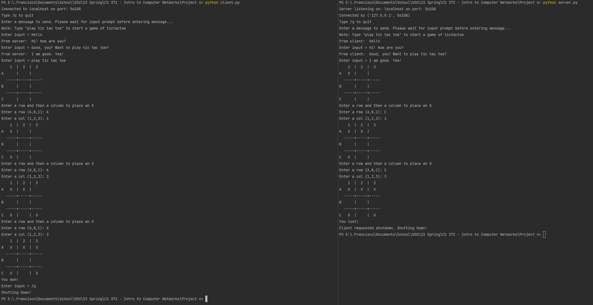

# CS 372 Intro to Computer Networks

Client server chat programs that allow players to chat and play tic tac toe through a network connection.

## Assignment Info

### Introduction
In this coding project you will first create a simple client-server chat room between a
client and a server program. This requires knowledge of socket programming and general
TCP considerations.
Later, your task is to design and implement a multiplayer ASCII game (any game) within
the chat programs between the client and server. This is to give you the opportunity to
experiment with more complicated procedures for sending information to and from the
client/server.
We also encourage you to engage with the extra credit portions of the assignment.

### Writing a client-server chat program
This client-server chat is fairly simple in design. The implementation will include two
files which provide a simulation of a client-server chat, although both programs operate
on the same system. Once both programs are started and connected to each other, the two
programs can send messages to each other. The chat process works on a turn-based
paradigm. The client goes first, then the server, then the client, etc. When a client is
prompting a user for input you will see the prompt “Enter Input >”. If you do not see this,
it is not the current processes turn. All messages sent must be limited to 4096 bytes.
Also, it is okay that quit/shutdown of one process (client or server) prompt the
quit/shutdown of its partner (server or client). The idea is to have the program send the
“/q” message to its partner right before quitting.
Finally, you will reuse a socket for the life of the program. The one issue with reusing
sockets is that there is no easy way to tell when you’ve received a complete
communication:
“… if you plan to reuse your socket for further transfers, you need to realize that there is
no EOT (end of transmission) on a socket. I repeat: if a socket send or recv returns after
handling 0 bytes, the connection has been broken. If the connection has not been broken,
you may wait on a recv forever, because the socket will not tell you that there’s nothing
more to read (for now). Now if you think about that a bit, you’ll come to realize a
fundamental truth of sockets: messages must either be fixed length (yuck), or be
delimited (shrug), or indicate how long they are (much better), or end by shutting down the
connection. The choice is entirely yours, (but some ways are righter than others).”
Source: https://docs.python.org/3.4/howto/sockets.html
Note that in the process of testing, you can “hang” a port. This will give an error when
you start the server: [Errno 48] Address already in use. Don’t worry, the ports will
recycle eventually.
There are several ways around this, including simply specifying a different port every
time you run. A good alternative, that mostly works, is to set a socket reuse option before
the bind command on the server: s.setsockopt(socket.SOL_SOCKET, socket.SO_REUSEADDR, 1)

### Specifications
Server
1. The server creates a socket and binds to ‘localhost’ and port xxxx
2. The server then listens for a connection
3. When connected, the server calls recv to receive data
4. The server prints the data, then prompts for a reply
5. The server sends the reply
6. Back to step 3
7. Sockets are closed (can use with in python3)

Client
1. The client creates a socket and connects to ‘localhost’ and port xxxx
2. When connected, the client prompts for a message to send
3. The client sends the message
4. The client calls recv to receive data
5. The client prints the data
6. Back to step 2
7. Sockets are closed (can use with in python3)

## Output Example
  
